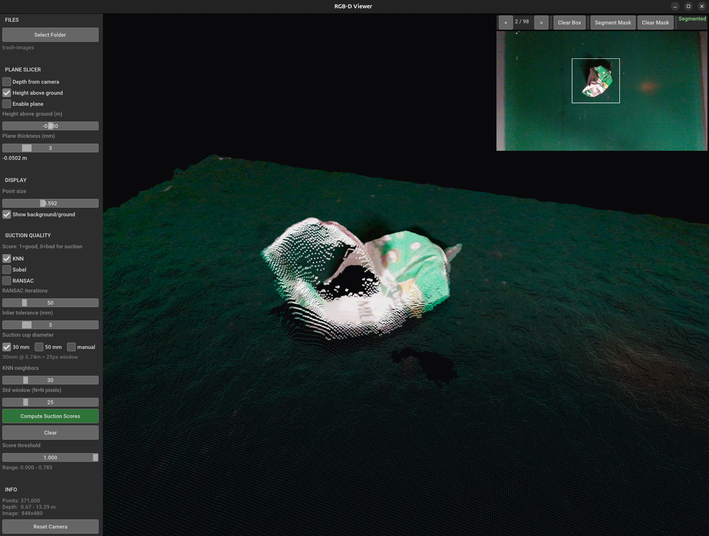
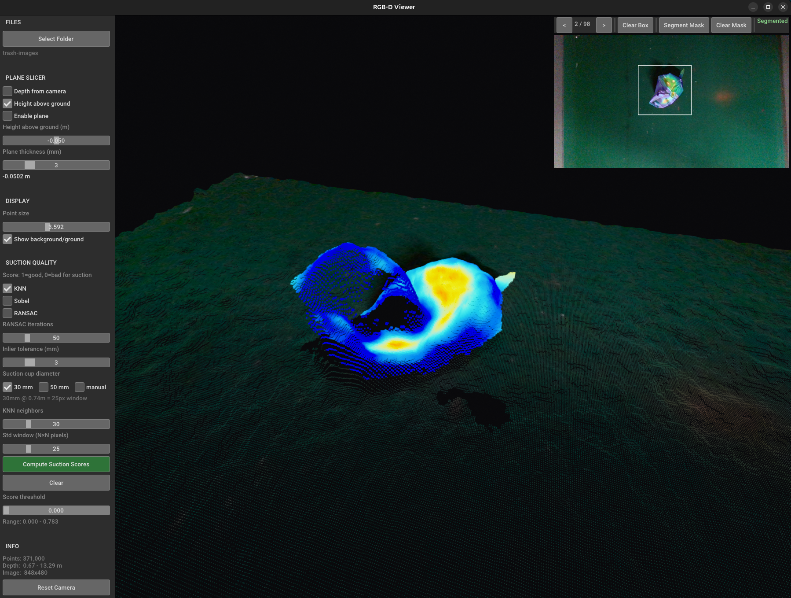

# RGB-D Suction Viewer

An interactive desktop tool for visualising RGB-D images and evaluating robotic suction grasp quality. Load an RGB image paired with a depth map, inspect the 3-D scene, isolate objects of interest with a bounding box or a SAM2 segmentation mask, and score every surface point with one of three suction quality algorithms — all in real time.

<p align="center">
  
  &nbsp;
  
</p>

---

## Features

### Point Cloud Viewer
- Loads matching RGB image + NumPy depth array (`.npy`) pairs from a folder, with prev/next navigation
- Back-projects depth into a 3-D colored point cloud using configurable camera intrinsics
- Statistical outlier removal (denoising)
- Interactive 3-D scene rendered with Open3D 

### Object Isolation
- **Bounding box** — draw a rectangle on the 2-D image panel to crop the point cloud to any region of interest
- **SAM2 segmentation** — run Meta's Segment Anything 2 inside the drawn box to produce a precise instance mask; the background is dimmed in the 3-D view for clarity

### Ground Plane & Plane Slicer
- Automatic ground plane detection via RANSAC
- Adjustable horizontal slab slicer — sweep through the scene by depth or by height above the detected ground plane

### Suction Quality Scoring
Three algorithms score every visible point from 0 (poor) to 1 (good):

| Method | Description |
|--------|-------------|
| **KNN** | PCA-based surface normal estimation over k nearest 3-D neighbours; flatness measured by local normal variance in image space |
| **Sobel** | Normals derived from XYZ-image spatial gradients (Sobel filters); fast and fully dense |
| **RANSAC** | Per-point local plane fitting inside a physically sized sphere; robust to noise and sharp edges |

Scores are overlaid on both the 3-D cloud (jet heatmap) and the 2-D image panel. A threshold slider hides low-scoring points. Suction cup presets (30 mm / 50 mm) automatically scale the scoring window to physical units at the current scene depth.

---

## Installation

### 1. Clone the repository

```bash
git clone --recursive https://github.com/marinmaletic/suctionView.git
cd suctionView
```

### 2. Install core dependencies

```bash
pip install -r requirements.txt
```

### 3. Install SAM2 

```bash
cd submodules/sam2
pip install -e .
cd checkpoints
# Download the small checkpoint (recommended)
wget https://dl.fbaipublicfiles.com/segment_anything_2/092824/sam2.1_hiera_small.pt
cd ../..
```

Then verify the paths in `config.yaml` match your checkpoint location:

```yaml
sam2_checkpoint: /root/suctionView/submodules/sam2/checkpoints/sam2.1_hiera_small.pt
sam2_config:     configs/sam2.1/sam2.1_hiera_s.yaml
```

### 4. Configure camera intrinsics

Edit `intrinsics.json` with your camera's parameters (RealSense JSON format).
The default file contains values for a RealSense D435 at 848×480.

---

## Usage

### Launch the viewer

```bash
# Open the viewer 
python main.py
```

### Prepare your data

The viewer expects a flat folder containing matching pairs of files with the same stem:

```
data/
├── frame_001.png   ← RGB image
├── frame_001.npy   ← depth array (H×W, raw depth units)
├── frame_002.png
├── frame_002.npy
└── ...
```

Depth arrays must be NumPy `.npy` files. Raw values are multiplied by `depth_scale` (default `0.001`) to convert to metres.

### Workflow

1. **Load data** — click *Select Folder* in the sidebar or pass the folder as a CLI argument. Use `<` / `>` buttons to navigate between frames.
2. **Isolate an object** — click once on the 2-D image panel to set the first corner of a bounding box, click again to confirm. The 3-D view updates instantly.
3. **Segment** *(optional)* — click *Segment Mask* to run SAM2 inside the box for a precise mask.
4. **Score** — select a suction algorithm (KNN / Sobel / RANSAC), adjust parameters, and click *Compute Suction Scores*. A heatmap appears on both views.
5. **Inspect** — use the plane slicer to sweep through the object at different heights; adjust the score threshold slider to highlight only the best grasp candidates.

---

## Configuration

All tunable defaults live in `config.yaml`:

```yaml
depth_scale: 0.001            # raw depth → metres

denoise_nb_neighbors: 20      # statistical outlier removal
denoise_std_ratio: 2.0

default_knn_k: 30             # KNN neighbour count
default_std_win: 25           # scoring window (pixels)
default_ransac_iters: 50      # RANSAC hypotheses per point
default_ransac_tol_mm: 3      # RANSAC inlier tolerance
```

---

## Requirements

| Package | Version |
|---------|---------|
| open3d | ≥ 0.18.0 |
| numpy | ≥ 1.24.0 |
| Pillow | ≥ 10.0.0 |
| opencv-python | ≥ 4.8.0 |
| torch / torchvision | *(SAM2)* |

---

